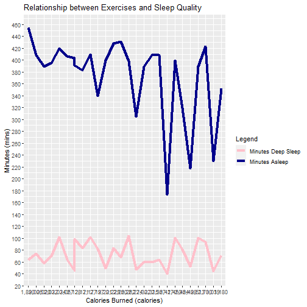

###_Sleep_Project_

Analyzing the relationship between reported sleep quality and levels of depression, anxiety and participant health data.

### *Authors*
1. Noah Rarick noah.rarick@gmail.com
2. Vincent Chen vchen5@uw.edu
3. Qiyuan Pan qiyuap@uw.edu
4. Wenyu Jiao wenyuj2@uw.edu

#### *Affiliation*
  INFO-201: Technical Foundations of Informatics - The Information School - University of Washington |
#### **Date**
**February 2nd 2022** 
|
### **Abstract**
How does an individual’s sleep quality effect their mental wellbeing regarding anxiety and depression levels? To address the question, we will compare the reported levels of anxiety and depression to reported sleep quality to see if there is a correlation between these factors. This is important because sleep is often overlooked by students as a possible factor in the depression and anxiety that students are facing at increasing levels.

.
### **Keywords** 
- *Human physiology*
- *Sleep quality*
- *Depression and anxiety*

### **Introduction**

_Sleep_Project_ is aiming to calculate trends between sleep quality and depression/anxiety. Sleep is incredibly important for an individual’s wellbeing, however, is often overlooked as a driving factor in depression, anxiety and panic levels. This project will focus on data reported on individuals regarding depression, anxiety, panic, BMI and age and see how these factors are related to sleep quality. By analyzing these trends, hopefully it will become apparent what correlating factors either promote or reduce sleep quality. 

### **Design Situation**
_Sleep_Project_ is hoping to provide insight to students on how sleep can positively or negatively affect mental wellbeing. In general, our goal is to provide statistical evidence that can influence student behavior to improve overall student body health. 

#### **Effects of Student Sleep Deprivation:**
Student performance and sleep quality are strongly linked according to research produced in “Cyberpsychology, Behavior, and Social Networking” by Lynette  Vernon. Researchers concluded that problematic social media use before bed was linked to increased sleep disturbances. These adolescents that had lower sleep quality also reported lower satisfaction with their schoolwork. The relationship between sleep and school satisfaction encouraged our research into how sleep deprivation may be linked to other negative health conditions. 

#### Sleep Apnea 
Research from the Journal of Clinical and Experimental Neuropsychology substantiates the claim that sleep is essential for mental health. The study conducted experiments on those with obstructive sleep apnea. Researchers concluded that
> “Poorer sleep quality was related to slower processing speed, somatic symptomatology and tension-anxiety levels."

So not only is sleep important for work satisfaction but is also a major factor in overall mental performance. For students aiming to optimize their performance, this is essential information that isn’t necessarily accessible or well known. _Sleep_Project_ is hoping to make this information more accessible for students such as ourselves. 

#### Social Media, Sleep Quality and Anxiety/Depression
Similarly, research in “#Sleepyteens” found links between social media use and decrease in sleep quality, resulting in higher HADS scores for anxiety and depression. Researchers found after surveying ~500 Scottish students that personal investment in social media was the strongest predictor of self-esteem issues, depression, and anxiety. The publication notes that social media use is strongly correlated with later bedtimes and less restful sleep, increasing sleep deprivation which increases risk of depression/anxiety. 

### **Research Questions**
- How does sleep quality change through the different age ranges? 
    -Finding average sleep quality of the different age ranges and comparing the mean sleep quality.
- What relationship does sleep quality have with anxiety? 
    -What are the levels of anxiety when sleep quality is low? Is the mean anxiety/depression score different among participants with above or below average sleep quality?
- How do reported levels of depression change as sleep quality decreases? 
    -Comparing the HADS depression scores across participants in relation to low, medium, and high sleep quality. 

### *The Dataset*
[Sleep Quality Data](https://www.kaggle.com/feraco/sleep-deprivation?select=demdata_160225_pseudonymized.csv)
(https://data.world/kmpearson/experiment/workspace/file?filename=Fitbit+Experiment.csv)
#### Origin and Size
Our data set is from Kaggle, produced from a Swedish study that unfortunately we cannot find the origin/publishers of. The data set has 106 columns for 91 participants and the elements that are researched range from HADS anxiety scores to sleep quality metrics to BMI and even participant info such as education level. 
The second data set is from "data.world". It is a monthly experiment based on
a person's daily exercises. And the outcome is the daily sleep quality of this 
person. We used this dataset for figuring out how will exercise affect people's
sleep quality.
#### Research Methods
For all mental health statistics, the HADS questionnaire was used. This is an extremely common questionnaire to assess the mental status of subjects. All the sleep data was obtained through the "Karolinska Sleep Questionnaire" which asks participants to self-report things such as wakeup times, sleep times, nap times, sleep quality, and even levels of panic/worry. Participant background information such as contraceptive status, BMI, height and age are all included. 
All participants were asked to complete the Brown ADD questionnaire, 5 Personality Trait questionnaire and more to provide background on each participant and note any confounding factors that may affect sleep quality.

#### Notes on Collected Data
The data set includes an incredible amount of information on each participant, providing a whole background on what lifestyle they may be living and what factors may affect their sleep. With so many data points, it may be difficult to find trends directly relating sleep to anxiety/depression as there are hundreds of confounding factors that the researchers collected. 

#### Participant Pool
The participant pool are residents of Sweden with varying ages, sexes, backgrounds and education status. From the data, there is a very wide assortment of participants. 

### *Implications*
Upon adequately conveying the correlation between an individual’s sleep quality and influence on various aspects in regards to health and mental well-being, some expected implications that may arise for technologists and designers derive from the fact that information technology such as social media, phones and other various forms of digital mediums are driving factors in promoting poor sleep quality amongst younger populations, as noted in the article “#Sleepyteens: Social media use in adolescence is associated with poor sleep quality, anxiety, depression, and low self-esteem,” in which Woods and Scott allude to how variables such as “Nighttime-specific social media use” and “Emotional investment in social media” displayed a notable significance in influencing an individual’s self-esteem, anxiety, and depression, as denoted by data collected in their study. The means and standard deviations draw attention to how “poorer sleep quality” was associated with “nighttime-specific social media use,” with a correlation coefficient r = .34, p <.001, providing a strong association between poor sleep quality and nighttime-specific social media use. While also linking an association between poor sleep quality on lower self-esteem, increased anxiety and depression levels, with the respective correlation coefficients, r = -.41, p < .001, r= .53, p <.001, r = .42, p <.001. (Woods & Scott, 2016). This sentiment may implicate technologists and designers as it may prompt necessary reforms in the ways in which social media usage is deployed to consumers and require systematic changes to apps limiting over-consumption possibilities. 

### *Limitations*
Some limitations that we may encounter derive from the fact that the participant pool is limited to individuals from Germany, this means that the data set would not be a good representation of the public as it doesn't account for other demographics of individuals. Another limitation is the age range involving the participants in the study. By only studying young individuals (20 - 30 years old) and old individuals (65 - 75 years old), the data's representation of analyzing the detriments of sleep quality is again, limited to only a subset of the population. Another limitation derives from the way in which the researchers accounted for an individual's sleep quality. By utilizing self-reports via sleep index and knowing that everyone has a different interpretation of what constitutes the quality of one's sleep, it makes it difficult to fully make sense of the data. The Karolinska Sleepiness Scale (KSS) implemented can vary in results depending on multiple parameters, such as earlier sleeping windows and time across participants, making it difficult to ensure the test-retest reliability. 

### *Acknowledgements*
Thank you to Christy Brown, who helped Vincent look for research materials on sleep deprivation and its effects on mental wellbeing.

### *References*
Additional information for this study were extracted from a research project at the Saveh University of Medical Sciences which was supported by Social Determinants of Health Research Center. The funders had no role in study design. “The Association between Internet Addiction, Sleep Quality, and Health-Related Quality of Life among Iranian Medical Students.” Taylor &amp; Francis, https://www.tandfonline.com/doi/full/10.1080/10550887.2020.1762826. 

CyberSightings | Cyberpsychology, Behavior, and Social ... https://www.liebertpub.com/doi/abs/10.1089/cyber.2015.29015.csi. 

“Neurobehavioral Functioning in Obstructive Sleep Apnea: Differential Effects of Sleep Quality, Hypoxemia and Subjective Sleepiness.” Taylor &amp; Francis, https://www.tandfonline.com/doi/abs/10.1076/jcen.26.1.43.23929. 

Woods, Heather Cleland, and Holly Scott. “#Sleepyteens: Social Media Use in Adolescence Is Associated with Poor Sleep Quality, Anxiety, Depression and Low Self-Esteem.” Journal of Adolescence, Academic Press, 10 June 2016, https://www.sciencedirect.com/science/article/pii/S0140197116300343#bib17. 

“Explore Scientific, Technical, and Medical Research on ScienceDirect.” ScienceDirect.com | Science, Health and Medical Journals, Full Text Articles and Books., https://www.sciencedirect.com/. 


```
## `summarise()` has grouped output by 'AgeGroup'. You can override using the `.groups` argument.
```

```
## Warning: `funs()` was deprecated in dplyr 0.8.0.
## Please use a list of either functions or lambdas: 
## 
##   # Simple named list: 
##   list(mean = mean, median = median)
## 
##   # Auto named with `tibble::lst()`: 
##   tibble::lst(mean, median)
## 
##   # Using lambdas
##   list(~ mean(., trim = .2), ~ median(., na.rm = TRUE))
## This warning is displayed once every 8 hours.
## Call `lifecycle::last_lifecycle_warnings()` to see where this warning was generated.
```

```
## # A tibble: 4 x 5
## # Groups:   AgeGroup [2]
##   AgeGroup Sex    avg_depression avg_sleep_quality avg_anxiety
##   <chr>    <chr>           <dbl>             <dbl>       <dbl>
## 1 Old      Female           1.05              5.11        1.68
## 2 Old      Male             1.32              5.32        1.26
## 3 Young    Female           1.08              5.25        2.92
## 4 Young    Male             1.21              5.25        2.92
```


|AgeGroup |Sex    | avg_depression| avg_sleep_quality| avg_anxiety|
|:--------|:------|--------------:|-----------------:|-----------:|
|Old      |Female |       1.045454|          5.113636|    1.681818|
|Old      |Male   |       1.315789|          5.315790|    1.263158|
|Young    |Female |       1.083333|          5.250000|    2.916667|
|Young    |Male   |       1.208333|          5.250000|    2.916667|

### **Table Summary**

The table above displays several statistics extracted from our data set. Firstly, it was decided that the most important factors to group by were age range and sex. By doing this, we could average the depression, anxiety and sleep quality scores for each group. The most important observation to take away is that while the group old males had the highest sleep quality, they also had the highest depression scores. Additionally, while old females had the lowest sleep quality, they had the lowest depression scores.Both young males and females had the highest anxiety scores, much higher than that of old females who had worse sleep quality. From this chart, it is hard to draw a relationship between sleep quality and depression and anxiety scores. 


```
## $average_sleep_quality
## [1] 5.236111
## 
## $below_average_sleep_depression
## [1] 1.485714
## 
## $above_average_sleep_depression
## [1] 0.9454545
## 
## $below_average_sleep_anxiety
## [1] 2.914286
## 
## $above_average_sleep_anxiety
## [1] 1.909091
## 
## $young_depression
## [1] 1.145833
## 
## $old_depression
## [1] 1.170732
```
### **Statistic Summary**

The above summary statistics help to quantify important relationships between sleep quality, depression and anxiety."Below average" and "above average" refers to whether or not the user was above or below the average sleep quality index. From this data it is much easier to draw a correlation between sleep quality and depression/anxiety. Participants with below average sleep quality had a HADS depression score of approximately 1.49, however participants with above average sleep quality had a HADS depression score of approximately .95. The same relationship can be seen in the HADS anxiety scores. Participants with below average sleep quality had a HADS anxiety score of 2.91, however participants with above average sleep quality had a HADS anxiety score of 1.90. From this data we can see that participants that had below average sleep quality also suffered from depression and anxiety at higher scores. The final two statistics I calculated was depression between the age ranges. I calculated the mean depression scores for those classified as young, coming out to 1.15. However, participants classified as old had a very similar average depression score of 1.17. From these statistics it seems as though sleep quality affected depression/anxiety much more than age.   

## Including Plots

```
## Error in loadNamespace(name): there is no package called 'webshot'
```

### Chart 1 Summary:

The implementation of the grouped dodged column bar chart data visualization is a means of illustrating the correlation between an individual’s sleep quality and reported level of depression. By grouping the data based on age group (Young versus Old versus NA), the data visualization showcases the deviation among the specified features. From the chart, we can see that as sleep quality diminishes (increases in value), young individuals are more prone to experiencing higher levels of depression, while depression levels remain fairly consistent across different sleep quality values for old individuals.



### Chart 2 Summary:

The implementation of the line chart data visualization is trying to prove the relationship between the amount of exercises and sleep quality. From the chart, we can see that when the daily calories start to increase, the minutes this person spent in deep sleep or regular sleep will be unstable. From my case, I don't see direct effects to sleep quality from increasing volume of doing exercises. But the minutes of deep sleep and minutes of staying asleep is proportional. From the side of this person, we can get a conclusion that the amount of exercises won't affect the person's sleep quality.


```
## Error in loadNamespace(name): there is no package called 'webshot'
```

### Chart 3 Summary:

This graph is about the show the relationship between people's sleeping quality and they anxiety they have. The graph is a scatter plot and will show how each point which representing a different age group are displayed.The age group are young, old and NA.So people can see how the old and young people's sleep quality data will be affected by their anxiety point. The graph has reveal that young people are more likely to be affected by anxiety level since they will have a larger range and spread out in the graph. The young people is are more likely to appear at the high level of anxiety and high sleep quality index while the old people is more likely to appear at low level for both level. 


Note that the `echo = FALSE` parameter was added to the code chunk to prevent printing of the R code that generated the plot.
